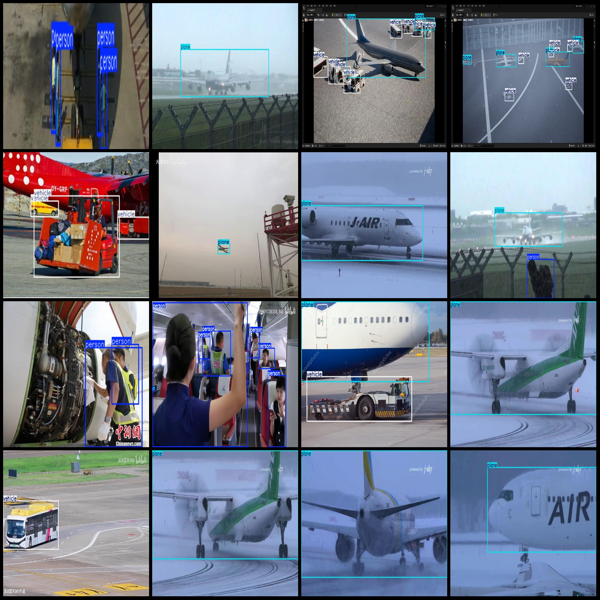
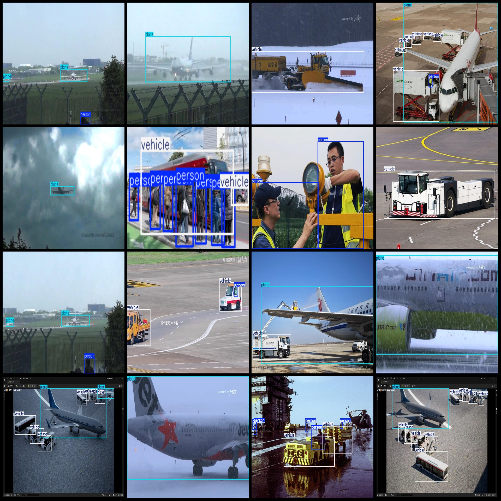

# Airport Ground Monitoring Vehicle, Airplane, and Bird Detection Dataset in Pascal VOC+YOLO Format with 1090 Images

## Dataset Format:
The dataset is formatted as both Pascal VOC and YOLO (excluding the split path in the txt file, only including JPG images along with their corresponding VOC-format XML files and YOLO-format TXT 
files).

### Number of Images (JPG Files):
- 1090

### Number of Annotated XML Files:
- 1090

### Number of Annotated TXT Files:
- 1090

### Number of Annotated Categories:
- 4

#### Annotation Category Names:
- "bird", "person", "plane", "vehicle"

Note that the order of categories in the YOLO-format may differ from this list, but it aligns with the labels folder's `classes.txt` file for reference.

#### Box Count for Each Category:
- "bird" (Bird) = 138
- "person" (Person) = 799
- "plane" (Plane) = 1332
- "vehicle" (Vehicle) = 2582

Total Box Count: 4851

#### Image Resolutions:
- Includes images at multiple resolutions, such as 1920x1080, 1280x720, etc.

#### Annotation Tool:
- LabelImg

#### Annotation Rules:
- Draw bounding boxes around the categories.

#### Important Notices:
- No guarantees are made regarding the accuracy of the trained models or weights files.

#### Image Preview:

## Images

Here is a pay link on Stripe ( https://buy.stripe.com/3cs8yP7sY87d0vu9AB ). Please contact me lonlonago@foxmail.com after funding $89, and I will send you a complete data files , thank you!

